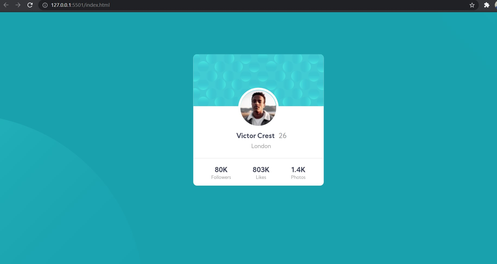

# Frontend Mentor - Profile card component solution

This is a solution to the [Profile card component challenge on Frontend Mentor](https://www.frontendmentor.io/challenges/profile-card-component-cfArpWshJ). Frontend Mentor challenges help you improve your coding skills by building realistic projects. 

## Table of contents

- [Overview](#overview)
  - [The challenge](#the-challenge)
  - [Screenshot](#screenshot)
  - [Links](#links)
- [My process](#my-process)
  - [Built with](#built-with)
  - [What I learned](#what-i-learned)
  - [Useful resources](#useful-resources)
- [Author](#author)

## Overview

### The challenge
- Build out the project to the designs provided

### Screenshot

### Links

- Solution URL: [Add solution URL here](https://your-solution-url.com)
- Live Site URL: [Add live site URL here](https://your-live-site-url.com)

## My process

### Built with
- Semantic HTML5 markup
- CSS custom properties
- Flexbox
- Mobile-first workflow

### What I learned
Use this section to recap over some of your major learnings while working through this project. 

### Useful resources

- [W3schools](https://www.w3schools.com) - This helped me for XYZ reason. I really liked this pattern and will use it going forward.
- [mdn-docs](https://developer.mozilla.org/en-US/docs/Web/CSS/position) - This is an amazing article which helped me finally understand positioning. I'd recommend it to anyone still learning positioning concept.

## Author

- Frontend Mentor - [@aquibkhn](https://www.frontendmentor.io/profile/aquibkhn)